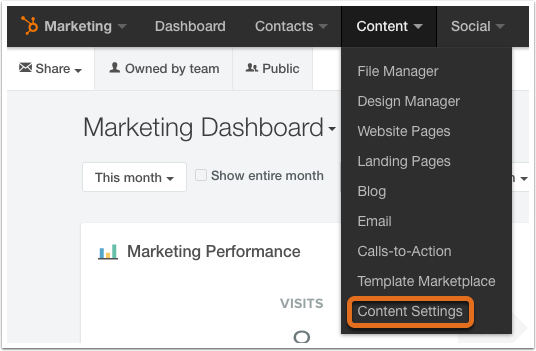

How the Slide-in Calls-to-Actions Can Increase the Traffic on Your HubSpot COS
==============================================================================

Without blogging, you won’t be in a position to increase traffic on your
website and boost your search rankings. As a matter of fact, blogging is
(and remains) an integral component of inbound marketing.

But did you know that over a million blogs are being produced on a daily
basis as part of inbound marketing strategies by your competitors? This
means that the content you create should not be educative, but also help
you generate more leads. The Calls-to-Actions (CTA’s) presents one of
the most viable options to help you generate more traffic for your
website.

Of course, there are a couple of different that you can optimize your
blog for increased traffic. More often than not, different websites use
different CTA’s strategies such as text-based in-line CTA, sidebar CTA,
End-of-the-post CTA and Slide-in CTA for increased lead generation.

But the main question is: “are the casual readers being converted to
leads and customers?”

The drawback with static CTA’s such as text-based in-line, sidebar and
End-of-the-post CTA’s is that a majority of visitors usually begin to
ignore them after a while. How about catching your visitor’s attention
by a dynamic and scrollable CTA?

Well, a Slide-in CTA can help generate more leads for your website. In
“How the Slide-in Calls-to-Actions Can Increase the Traffic on Your
HubSpot COS”, we explore how the Slide-in CTA’s can help increase
website traffic. We also explore the procedures for placing these CTA’s
on your blog. Let’s get started.

Why the Slide-in CTA’s are better
---------------------------------

Here’s why the Slide-in CTA’s are superior to static CTA’s:

### \#1: They are catchy

It’s a fact that the Slide-in CTA’s are more appealing to the eye and
therefore visitors are more likely to click them compared to static
CTA’s. This is because they are more elegant and more compelling than
other CTA’s.

### \#2: They have no effect on SEO

Don’t panic about search rankings when you use the Slide-in CTA’s.
Here’s the thing: the Slide-in CTA’s have no effect on SEO capabilities
of your blog, therefore there’s no point fearing to use them.

### \#3: They are more visible to the eye

Here’s the fact: if your CTA isn’t visible to your visitors, it won’t
convert. The fact that Slide-in CTA’s are more visible to the eye means
that you’ll convert more visitors when you use them on your website.

So, how can you place Slide-in CTA’s on your HubSpot COS?
---------------------------------------------------------

Good question.

Ideally, there are two ways you can get around this problem. These are:

-   **Using popup forms**

-   **Modifying the HTML code template**

Let’s dig in.

### \#1: Using Smart Forms plugin for HubSpot

If you want a compromise, yet very effective method to present forms in
a friendly manner that can increase the conversion rates, then you
should try out plugin called [Smart
Forms](https://integrationagent.com/smartforms/).

### \#2: Modifying the HTML code template

To place the Slide-in CTA on your blog, you need to add a JavaScript
code to your HubSpot blog’s template HTML code and modify the CSS
stylesheet. To achieve this, below are steps to follow:

1.  **Add JavaScript code to blog’s HTML code template**

Here’s is how you can modify the HTML code template of your blog:

-   On your HubSpot’s COS dashboard, click the Slide-in CTA
    JavaScript button.

{width="6.25in" height="3.6145833333333335in"}

-   Access the &lt;BODY&gt; of your blog’s template and copy/paste the
    following JavaScript code:

&lt;script type= “text/javascript”&gt;

\$(function() {

var slideCTA = \$(“\#slideCTA”);

if (slideCTA.length&gt;0) {

\$(window).scroll (function () {

var distance Top = \$(“\#last”).offset().top - \$(window).height();

if (\$(window).scrollTop() &gt; distance Top){

SlideCTA. Animate ({“right”: “0px”},300);

}

else{

SlideCTA. Stop (true).animate ({“right”:”-400px”}, 100);

}

});

\$(“\#slideCTA .close”).on (“click”, function () {

\$(this).parent ().remove ();

});

}

});

&lt;/script&gt;

-   Save the changes you’ve made to the &lt;BODY&gt; section of your
    HTML code template.

1.  **Modify the CSS template**

Copy/paste the following code into the &lt;BODY&gt; section of your HTML
template:

\#slideCTA {

padding: 8px 15px 8px 10px;

background-color: \#ffe;

border-top: 4px solid \#F6261F;

position: fixed;

bottom: 0;

right: -400px;

-moz-box-shadow: -2px 0 5px \#aa9;

-webkit-box-shadow: -2px 0 5px \#aa9;

box-shadow: -2px 0 5px \#aa9;

}

a.close {

width: 12px;

height: 12px;

position: absolute;

cursor: pointer;

top: 10px;

right: 10px;

}

a.close:hover {

background-position: 0 -12px;

}

\#slideCTA {

width: 100%;

}

}

Next up, you’ll create the image for the Slide-in.

1.  **Add image to the Slide-in CTA**

-   Download your favorite image that you’d like to add to the CTA.

-   Upload the image to the website. Ensure you copy the image file
    location to the Clipboard.

1.  **Add the CTA code to bottom of the blog**

Copy/paste the code below at the end of your HTML code template:

&lt;div id= “slideCTA”&gt;&lt;a class= “close”&gt;&nbsp ;&lt;
/a&gt;&lt;a href= “http://name of yoursite.com/landing-page” target=
“\_blank"&gt;&lt;img class= “shadow alignCenter” style= “width: 90%;
height: auto;” src= “http://name of
yoursite.com/images/cta-image.jpg”&gt;&lt;/a&gt;&lt;/div&gt;

That’s it. Your blog should now generate more leads for your business.
