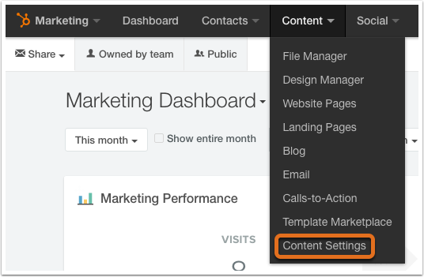

Why You Need SSL to Accept Payments and How to Setup SSL Certificate on HubSpot Website
=======================================================================================

What makes a great online store? It used to be that mobile optimization,
great content, and responsiveness alone were enough.

Well, part of the process that you must accomplish when developing an
online store is determining how to secure online experiences of your
customers. If you’re new to online stores, you might get confused on SSL
certificates as a primary component of the web security process. You may
have tons of queries such as: what it is, how it works and more
important, how to set it up on your HubSpot website.

In “***Why You Need SSL to Accept Payments and How to Setup SSL
Certificate on HubSpot Website***” we break it down for you so that you
understand what SSL is, why you need it on your website and how to set
it up on your online store. Let’s get started.

What is SSL?
------------

SSL is an acronym for Secure Sockets Layer. In some instances, it’s
called the TSL (Transport Security Layer). SSL is simply a protocol that
encrypts transactions between a client application (a browser) and the
online store server. Simply put: SSL protects the sensitive information
such as credit card details—by making them private and confidential—from
being stolen by malicious users over the internet.

SSL uses an encryption algorithm that ensures that each message being
exchanged on the web passes integrity test before being transmitted. If
the integrity test fails—due to corruption or an unexpected alteration
by malicious users—then such a transaction doesn’t proceed to successful
conclusion.

For you to enhance the security of online transactions, you should
obtain an SSL certificate that’s relevant for that domain. The
certificate will apply the encryption algorithms for all the
transactions that take place between customers and your online store.

Why is SSL certificate vital for accepting payments?
----------------------------------------------------

As online mercantile, it’s your primary responsibility to ensure that
the information being exchanged over your online store—which you collect
from your customers—is protected at all costs. Here are reasons why you
should protect your customer’s sensitive information such as credit card
and personal information:

### \#1: Confidential Transactions

The primary objective of any SSL is to transmit sensitive information
with an encrypted connection. Your customers must be assured that their
private data such as usernames, passwords and credit card numbers are
not revealed to malicious attackers while they are making online
payments.

### \#2: Customer’s Trust

The majority of online shoppers are very choosy when it comes making
online payments. Therefore, it’s your duty to convince them their
privacy is guaranteed so that they trust your business and your
products. An SSL enabled online store improves customer’s trust to your
business.

How to set up an SSL certificate on a HubSpot website
-----------------------------------------------------

The process of setting up an SSL certificate on a HubSpot website is
akin to connecting a domain to HubSpot. However, you’ll be required to
incorporate a few basic steps to ensure SSL is enabled on your website.
Below are steps that can help you set up an SSL certificate on a HubSpot
website:

-   Request to have access to the SSL certificate by getting in touch
    with your Customer Success Manager. You’ll be informed when you have
    access to the SSL certificate.

-   Navigate to your HubSpot’s Domain Manager by clicking
    **Content**&gt;**Content Settings**. You should see a screenshot
    similar to the one below:

    {width="5.3019017935258095in"
    height="3.542361111111111in"}

-   Locate the “***Content Optimization System Tools***” from the
    sidebar navigation and click “***Domain Manager.***”

    {width="6.125699912510936in"
    height="4.752777777777778in"}

<!-- -->

-   Type in the sub-domain—of the online store— that you would like to
    connect to HubSpot. Now note that a different SSL provisioning
    process is mandatory for each secure domain that you specify.

    {width="5.4269017935258095in"
    height="3.1659722222222224in"}

-   Tick the “***Enable SSL***” option. You can only view this option if
    you have an add-on on your website or you have purchased the
    standalone SSL.

    {width="5.3019017935258095in"
    height="5.962941819772529in"}

-   Click on “***Connect Domain***” after you have selected the content
    types that you would like to use with SSL for your sub-domain.

    {width="5.3019017935258095in"
    height="5.576796806649169in"}

-   The provisioning process will start. This requires the generation of
    an SSL certificate and verification of the domain ownership. If
    you’re set to start the provisioning process, click on “***Enable
    SSL***.”

    {width="4.997749343832021in"
    height="2.6277777777777778in"}

-   You should now see a confirmation prompt that the provisioning
    process has started and is in progress. After this process starts,
    HubSpot will send you a confirmation message that the process has
    been initiated.

    {width="4.1769017935258095in"
    height="2.7243055555555555in"}

-   After adding your domain, you’ll have 7 days to validate that domain
    with HubSpot to prove the ownership to the certificate. Clicking on
    the option “**validate your domain**” in the banner at the top of
    the Domain Manager helps you to validate the domain.

    {width="5.8019017935258095in"
    height="2.451195319335083in"}

-   You can use either “Set up a redirect link” or “create a new page”
    to validate your domain.

    {width="6.0519017935258095in"
    height="2.75in"}

-   Now select the content types that you would like to host on your
    secure domain. Or, you can select the “***redirect this domain to
    another connected domain***.”

-   Once you have verified your domain with the SSL certificate
    authority, you’ll receive an email from HubSpot. Now go back to the
    ***Domain Manager***. You will now see a notice that informs you
    that need to update the CNAME record for the certified domain. Click
    on that so that you can see your CNAME.

    {width="6.5in"
    height="2.090540244969379in"}

-   Now copy your CNAME.

    {width="6.59375in"
    height="2.7916666666666665in"}

-   Update your CNAME within the “nameserver” host.

    {width="6.59375in"
    height="1.416580271216098in"}

-   Verify that the domain is connected after 24-48 hours.

    {width="6.010416666666667in"
    height="2.2708333333333335in"}

